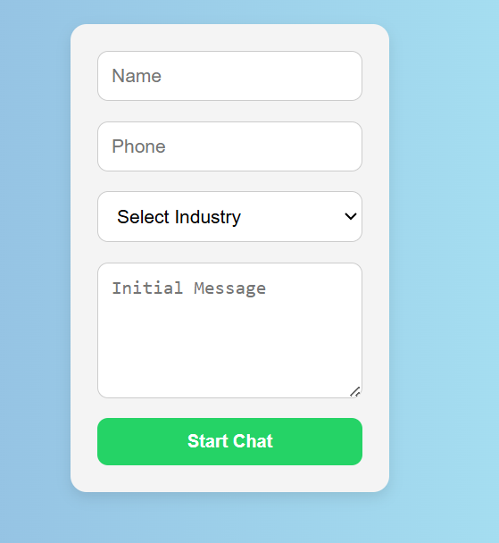
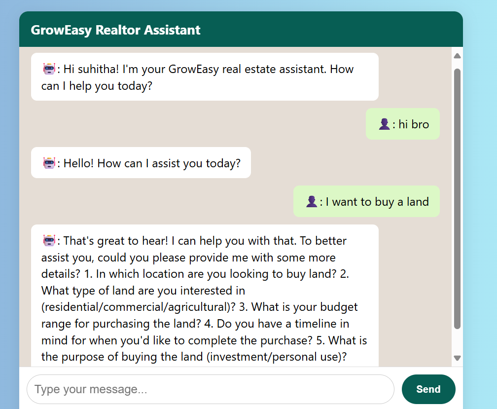
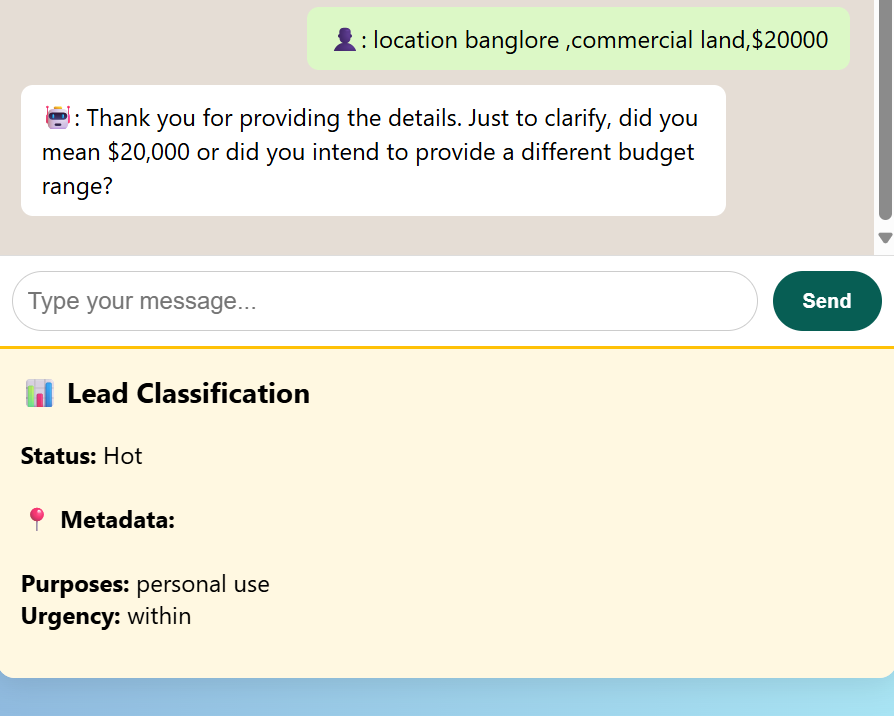

# GrowEasy AI Chatbot – Multidomain Lead Qualification Assistant

GrowEasy is an AI-powered full-stack web application that simulates a WhatsApp-style chatbot for qualifying leads across multiple industries, including Real Estate, Education, and Automobile. The chatbot engages users in natural conversation, extracts relevant metadata, and classifies leads as **Hot**, **Cold**, or **Invalid** based on configurable industry profiles.

---

## 🚀 Features

- 🤖 Interactive chatbot with a real WhatsApp-style UI
- 🏠 Real Estate, 🎓 Education, and 🚗 Automobile industry support
- 🧠 Lead classification using conversation intelligence
- 🗂️ Metadata extraction (location, budget, course type, urgency, etc.)
- 🔍 Domain-specific logic powered by business profiles
- 🧱 Modular, configurable system to add more industries easily
- 🌐 Full-stack implementation with Node.js backend and React frontend

---

## 💻 Tech Stack

| Layer       | Technology             |
|-------------|------------------------|
| Frontend    | React.js, Tailwind CSS |
| Backend     | Node.js, Express.js    |
| AI/LLM      | OpenRouter (GPT model) |
| Styling     | WhatsApp-style chat UI |
| Deployment  | GitHub + Vercel        |

---

## 🧪 How It Works

1. User interacts with a chatbot like in WhatsApp.
2. Chat is streamed to the backend.
3. Backend uses LLM API to generate the bot’s replies.
4. Final chat is analyzed for:
   - Metadata (e.g., budget, timeline, property type, etc.)
   - Lead classification (Hot / Cold / Invalid)
5. The result is shown at the end of the conversation.

---

## 🧠 Lead Classification Logic

Each business domain has its own set of metadata fields. Example:

### Real Estate:
- `location`, `budget`, `propertyType`, `purpose`, `timeline`, `urgency`

### Education:
- `courseType`, `mode`, `budget`, `urgency`, `certification or degree`, `start date`

### Automobile:
- `vehicleType`, `budget`, `usage purpose`, `urgency`, `fuel type`

Leads are classified based on presence of key metadata and intent.

---
## 🖼️ Screenshots

### 🔹 User Form – Start Chat


### 🔹 Real Estate Chat Interface


### 🔹 Lead Classification Output



---
### 3. Add your OpenRouter API key

Create a `.env` file inside the `/server` directory and add your API key like this:

```ini
OPENROUTER_API_KEY=your-api-key-here

